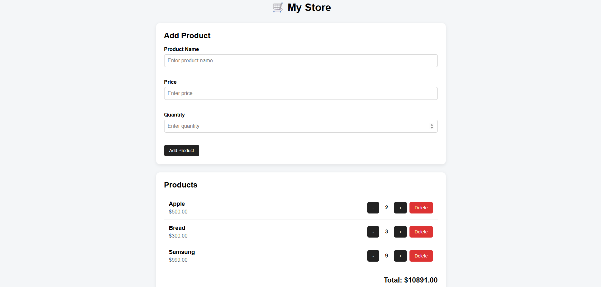

# DOM Store - Kosher

## How to open

Open `index.html` in a web browser.

## Project description

This project is an interactive product store created using pure JavaScript and the DOM API. The application allows users to add products with name, price and quantity. I used the submit event for the product form to add new products and validate input fields. I used event delegation on the product list to handle increasing, decreasing and deleting products. The total price is recalculated automatically after every change without reloading the page.

## Features

- Add products
- Validate product name, price and quantity
- Delete products
- Increase and decrease quantity
- Live total calculation
- Event delegation
- Pure JavaScript and DOM API

## AI tools

ChatGPT was used to help understand the task, JavaScript DOM concepts and organize the project.

## Screenshot

